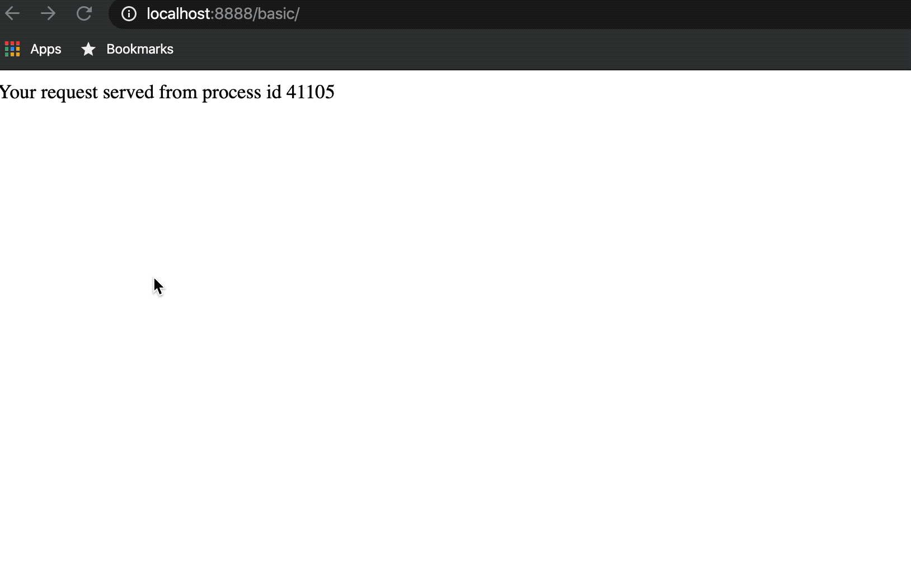

# Load Balancing with Nginx and Django

Please watch tutorial from [Hussien Naseer](https://www.youtube.com/watch?v=4xGQS8Pv4io)

- First create a `hello world` application of django. instead of returning `hello world` as `HttpResponse`. send `process id` as response. and then, run three instances of the same applications by opening different terminal tabs. ( Command+T shortcut to open new terminal tab in iterm2).

    ```bash
    >>> python manage.py runserver 0:1111

    >>> python manage.py runserver 0:2222

    >>> python manage.py runserver 0:3333
    ```

- In django `setting.py` under ALLOWED_HOSTS add pythonweb

    ```bash
    ALLOWED_HOSTS = ['pythonweb']
    ```

- Create configuration for `nginx loadbalancer`. as `python.conf`. I have created in project folder. you can create whereyou want it. (you can create naming convention as you like). and paste following contents to that file.


    ```bash
    upstream pythonweb {

        server localhost:1111;
        server localhost:2222;
        server localhost:3333;
    }

    server {
        listen 8888;

        location /basic {
            proxy_pass "http://pythonweb/basic";
        }
    }
    ```

- Now, go to `nginx.conf` file in `/usr/local/etc/nginx` and add `include` to above file that you created.

- run following commands

    ```bash
    sudo nginx -s reload
    ```

### Demo


